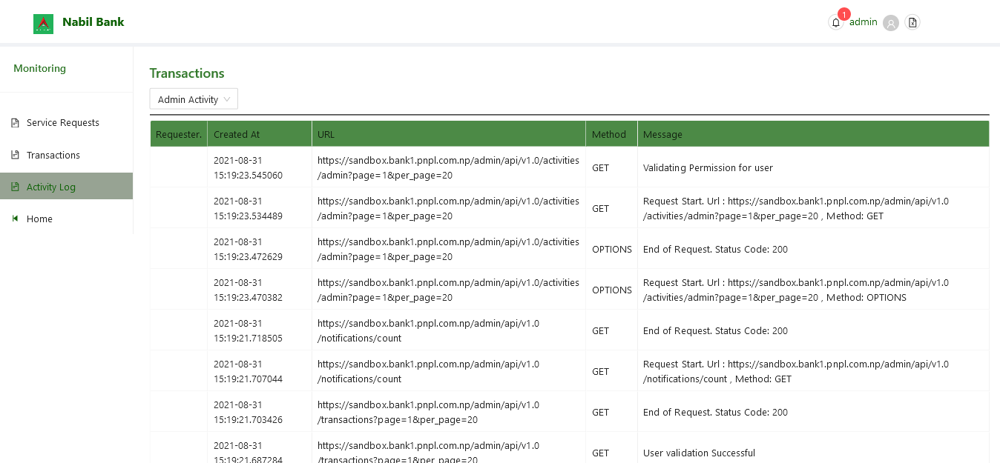

# Activities

By deafult, admin activities are listed. The details pertaining to such logs can be browsed from respective columns.

A selection box is provided to switch between the activity logs. The following option are available:

* Admin Activity Logs
* App Activity Logs
* Account Activity Logs
  

### Admin Activity Logs
Admin Activities enlists all actions made withi the gateway application. It shows details of user requeted url and response status from such requests. ANy unhandled exception is also listed in the logs.

### App Activity Logs
All the requests forwared via application to the APBS gateway are listed in this section. The App Activity Section also maintains comparable details as that of Admin Activity Section.

### User Activity Section
It lists all the requets from customer / Business customers end. These requests are the actual transactional processing requets that is carried out through the APBS system.

Note: A user can also filter current listed transaction with respect to requesting service type or application name.

Note: User may browse all transactions py simply chaning current active page in the pagination footer of table.