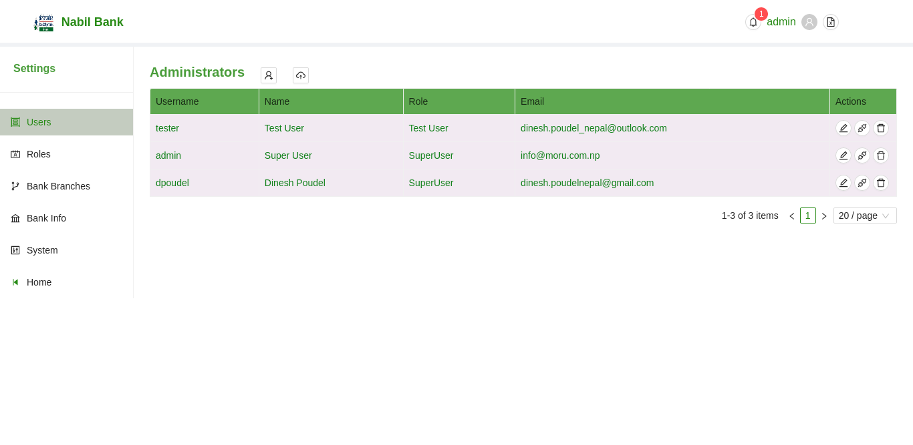
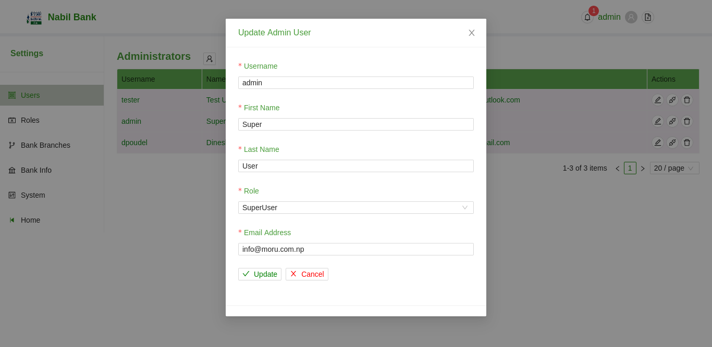
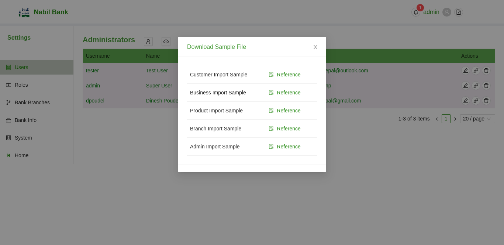

# Admin

Admin section lists all configured administrators. User with appropiate user right shall be able to add/ update or delte admin users.

The table above shows example scenario where a User has been pre-configured. User can add new user by click the + button or import users from Excel file by clicking the upload button respectively.

On similar note, admin user can edit or reset application credential for existing user by click on the button in the action tab.

### Add new Admin User

* To Create a new user, click on the User + Icon in Action sub-header.

* Fill in the required details including the Role type.

* Click on Create Button

* Users will be updated upon successful completion.

* In case any error occurs, a message will be shown.

### Update Admin User

* Click on the Edit Button in the row of the desired admin users in the table.

* Update the necessary details.

* Click on Update Button

* Users will be updated upon successful completion.

* In case any error occurs, a message will be shown.

### Reset Users

To reset a user password, Click on the button left to delete the button in the desired row of users. The user password will be reset and the respective user shall receive an email.

### Delete Users

To delete a user, click on the delete button in the desired row of users. The user will be deleted.

### Import Users

To import a user, click on the upload button in the action header with Cloud Outline Icon.

For successful completion, data format must be as per pre-defined standard i.e. an xls file with predefined column structure.

To view sample admin import File, click on the button next to the user avatar in the header. A modal will show the reference to the respective files. Click on the Admin Import Sample Reference Button. A file will be downloaded.
