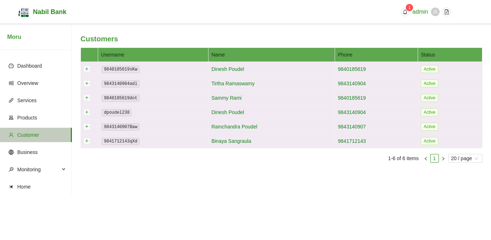
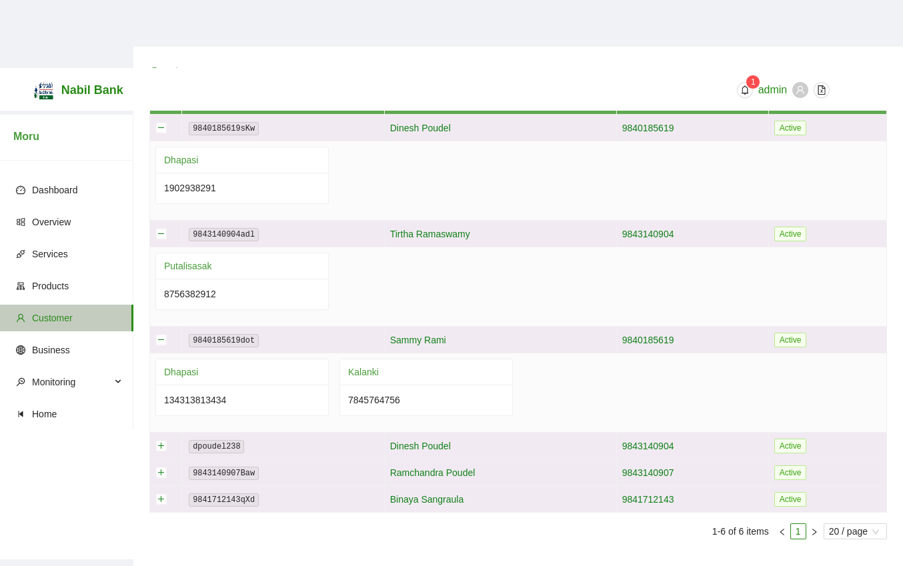

# Application Customers

Customers section with Application Details lists all the customres registered for APBS acces for current application. It shows basic details and status of each customers.

### Customer Bank Accounts

User can further view the total account activated for each accounts by clicking the + button in the first column of the customers table. On clicking + button, the row will expand and details relating to the bank branch and account number will be displayed.

