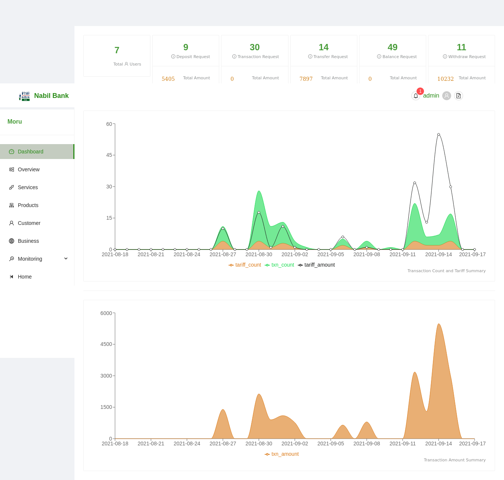

# App Dashboard

Application Dashboard enlists information about the total number of users and total service requets processed via the system.

### User Information Cards
1. The first card on the screen shows total number of APBS users registered in the application.
2. Consecutive cards i.e. card 2-6 show the total number of services requestes processed through APBS system.

### Graphs Section
3. The remaining section of the app dashboard shows the graph relating to the total tariff amount, tarriff count, and consecutive transaction amount and transaction count for past thirty days. These graph are intended to access the load of system in past 30 days.