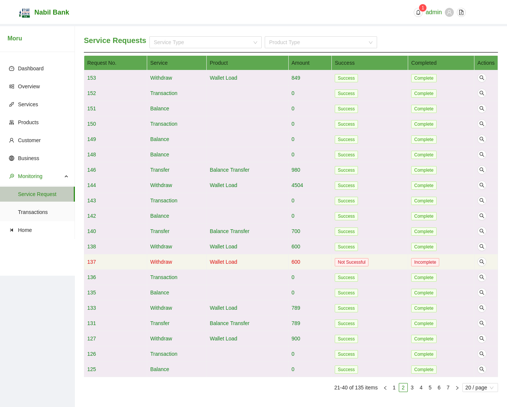
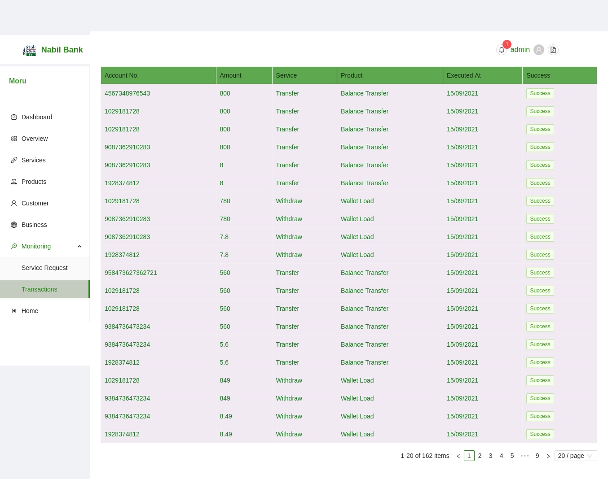

# Service Requests

By deafult, all service requests from customers front are listed. The status and completion of such requests can be verified from the **Success** and **Completed Column**.

Note: Success referes that transaction was sucessfully executed. For a transaction to be complete, it have successfull run. One key difference between these fields is, a successful request will always be completed however, a completed requets may not have always been successful, i.e. transaction could have been rejected from core banking system itself.

Note: There is no visual difference between the Gateway Service Request seciton to App Service Request Section except the fact that only requets related to current application are listed in AppServiceRequests Section.

Note: A user can also filter current listed transaction with respect to requesting service type or product name.

Note: User may browse all transactions py simply chaning current active page in the pagination footer of table.

## Service Request Details

To browse the service request Details simply click on the browse icon in the row of desired service request.

Note: Information pertaining to such details are exactly same as [Gateway Service Request](serviceRequests.md)

# Transactions

By deafult, all available transactions for current application are listed. The status and completion of such transaction can be verified from the **Status** and **Completed** Column.

Note: A user can also filter current listed transaction with respect to requesting service type or product name. By default, product selection will list all available products, such selection will be updated once user selects corresponding service type i.e. Once user selects a service type, only products assigned with such service type will be listed for selection.

Note: User may browse all transactions py simply chaning current active page in the pagination footer of table.