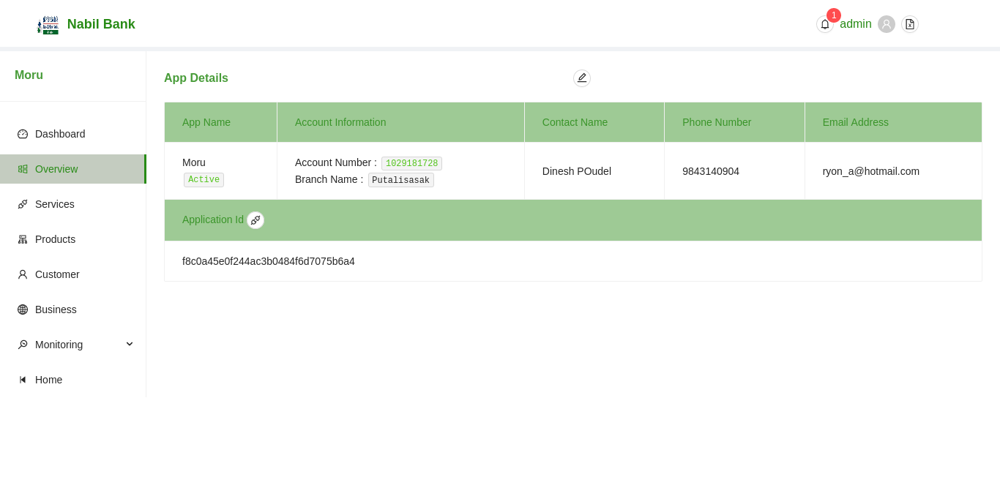
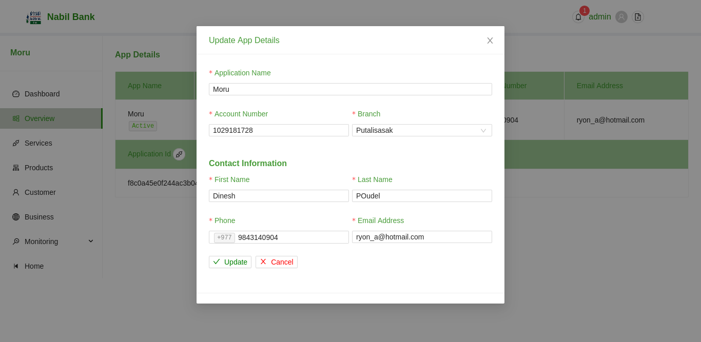
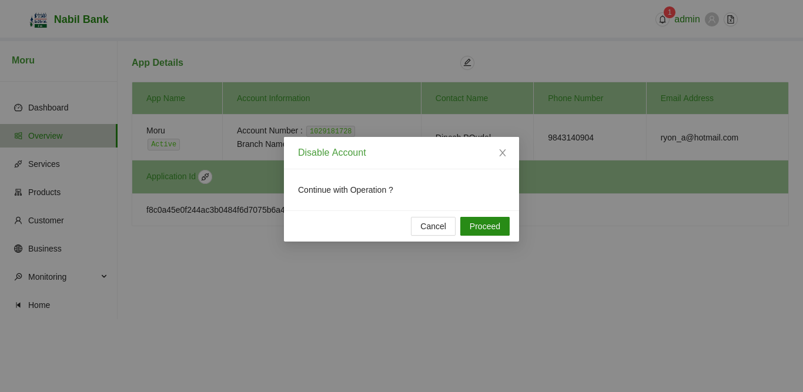

### Application Details

To view the additional details of Application, click on the browse icon in the same row as the listed app.

The details of each application can be edited from within the newly rendered screen. To edit app details, click on the edit button in the top section of App Overivew page.

Note: To be able to edit such details, correct user permission will be validated. If curent user doesn't have necessary permission, edit button will be disabled.

A user can also enable/disable application account.

### Edit Application Details

To edit existing information, click on the edit outlined button. A user modal will be opened to facilitate such changes.

* Edit all required fields
* Click on save button
* Updated information will be reflected

### Disable/ Enable current Application

To enable/ disable current application, click on the status description under AppName section. A pop-up will open for user consent.

Upon successful completion, application status will change.

### Reset Application Secret

To reset application secret key, click on the api outlined button next to ApplicationId section. A pop-up will open for user consent.

Upon successful completion, application secret will change. Respective contact will get email with updated credentials.

