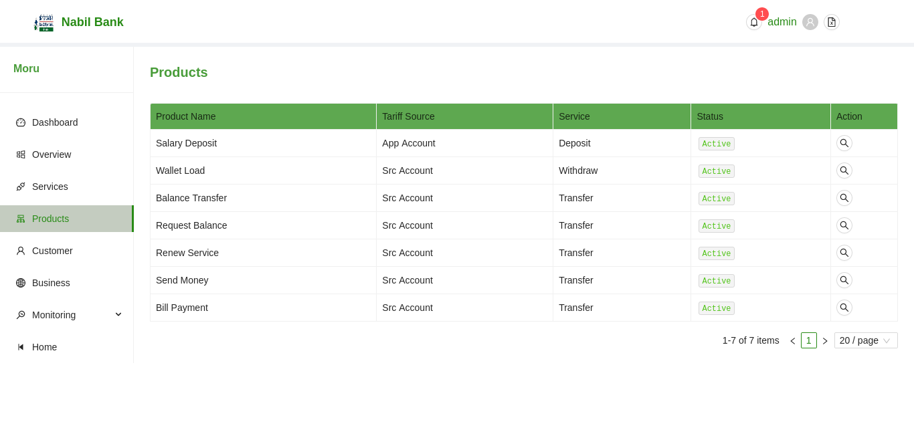
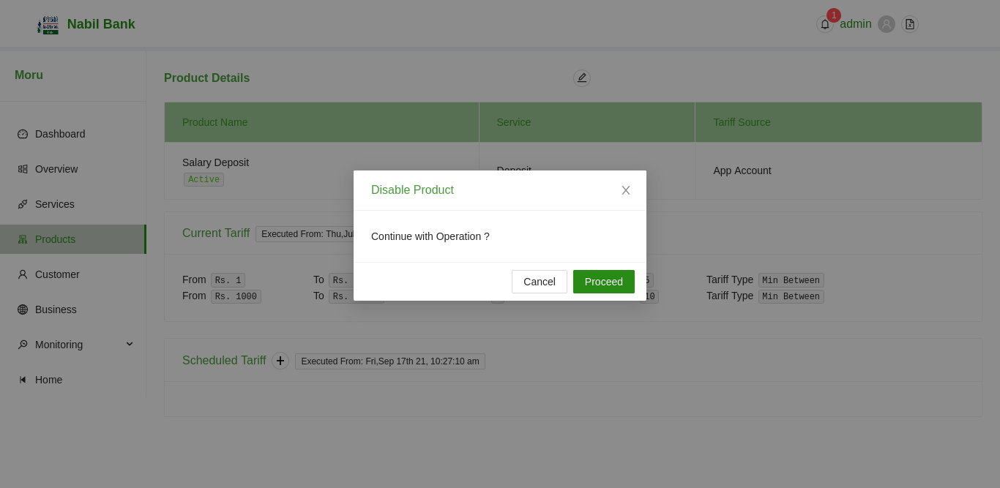
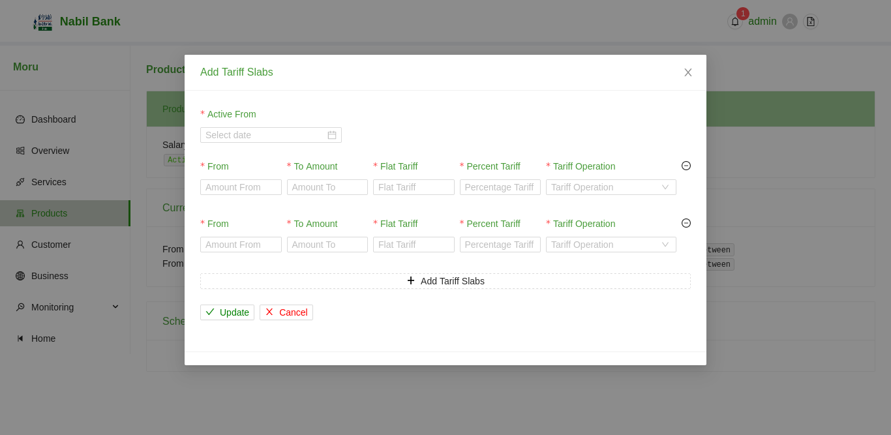

# Application Products

The Products screen within Application section will list all available products by default. The list will show the basic details including the product status configured for the application.

### Product Details

Details of each product can be viewed by clicking on the browse button unde the action column of individual product. On clicking browse button, details for products will be rendered.

### Change Product Status

To change the current product status, click on the status label under the product Name in description section. User can change the status after confirming the action modal.

### Edit Product Details

To edit the details related to each products, simply click on the edit outline button.
* A user modal will open
* Edit relevant details
* Click on Update to save changes
* Click Cancel to disacrd changes

### Edit Scheduled Tariff

To edit or add new scheduled tariff, click on the + Button .
* A user edit modal will open
* Fill in relevant Details
* Click on Update Button to save changes
* Click on Cancel Button to discard changes.

Note: Tariff Slba are mandatory i.e. at least one slab must be present

Note: The scheduled date must be equal or greather than today. If scheduled date is immediate, current tariff will be replaced. If scheduled date is greather than current time, scheduled tariff will be updated.

Note: While adding multiple tariffs, it is mandatory that minimum amount of current slab must match maximum amount of previous slab. This is a feature in itself. Failure to meet the range requirement will result in error.

Note: Usr can add a many tariff as required. However atleast 1 tariff slabs must always be present.