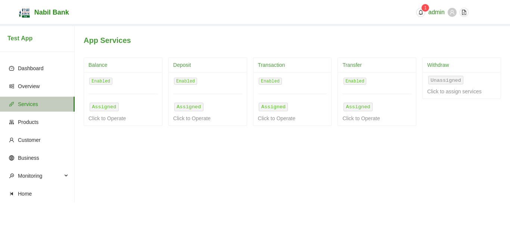
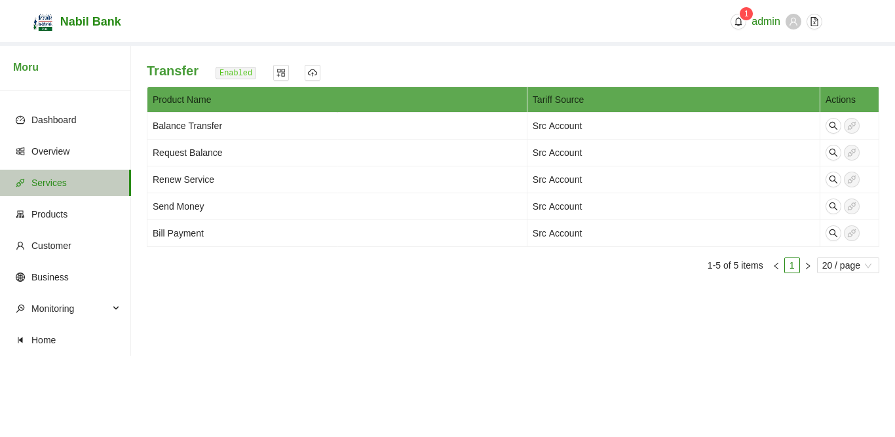
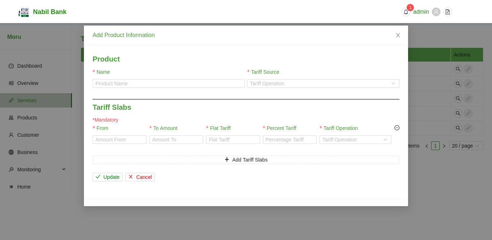

# App Services
The App Services section enlists all available services. Services previously assigned will be displayed as assigned, while services previously unassigned will be displayed as unassigned.

# Service Details and Products

To edit the status and add products to application services, simply click on the card for respective services. A new window shall appear with pre-registered products if any.

### Change status of App Service

To enable/disable current selected app service, simply click on the status text in the top section of the Service page.

### Add New Product Service

To add new product Service:
* Click in the + Button in the top section of Service Page.
* Fill in the required details including Tariff charge an operations.
* Click on Update Button to save changes
* Click on Cancel button to discard changes
* Upon successful update operation, newly added product will be listed

### Import Product Service

Users can also import product services from excel files, to import products an excel fiel with pre-defined formatting should be used available at sample file modal. Upon successful import of product files, product list will be updated if imported products are valid. A user notification will be recieved after completion of such operations.

To initiate upload action, click on file upload icon in the top section of service page. Only valid Excel files are allowed to be uploaded.