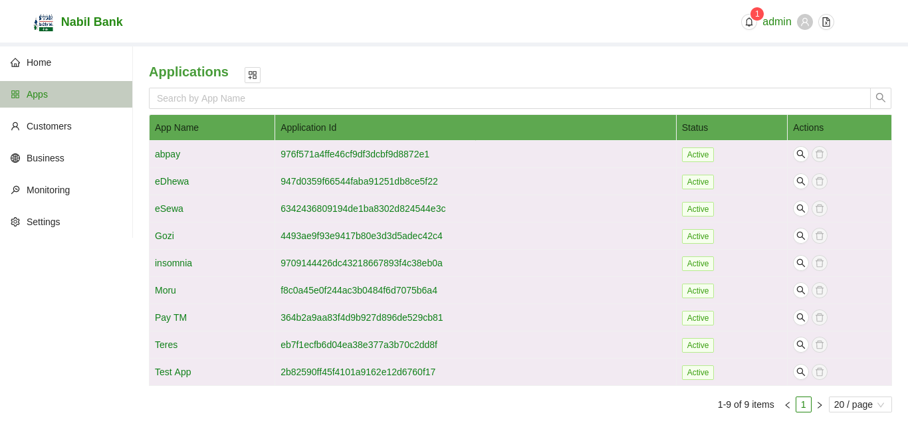
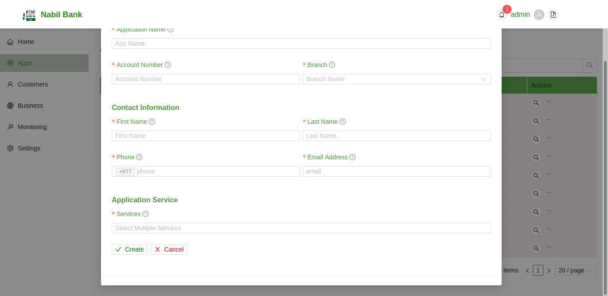

# Applications
The Application Section enlists all the pre-registered Applications. 
  

### Search Applications
By default, Application will be listed wihtout any filters. User can filter such list by Application Name.

* To Search simply type the value and press enter.
* To reset the filter click on the clear icon in the search box or manually delete input text and press enter

### Create new Application
To enroll a new application, user can click on the + button in the top section.

* Click + button
* Fill in the related details, all fields are mandatory
* Click on Create button to save changes or Cancel button to discard changes. 
* Upon successful execution, newly created application will be listed in the Apps section.