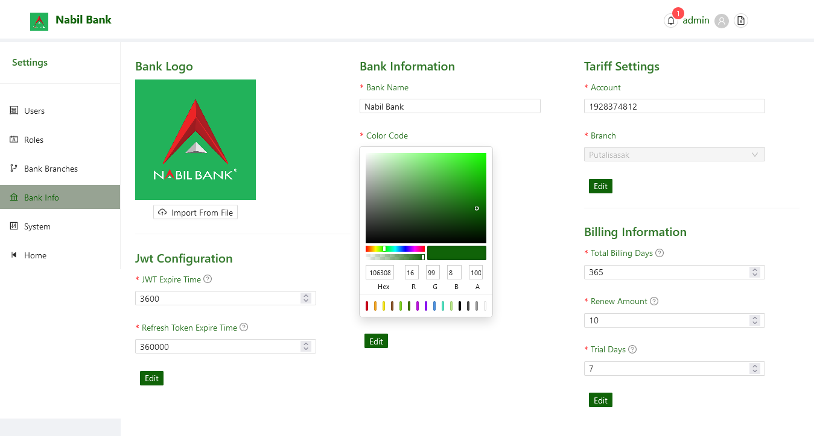

# Bank Information

Bank Information gives in general configuration for bank. User may access Bank Information Page for any of the following operation:

* Upload Bank Logo
* Change existing JWT Configuration
* Update Bank Name and Color Code
* Change Tariff Account Information
* Change Billing information
  

### Steps to Edit Information

By default, form field in Bank Information section will be disabled. User can click on the edit button on respective forms to be able to update existing settings.

* Click on Edit Button
* User can now see Save and Cancel Button
* Edit Form Values
* Click Save
* User updated values will be reflected