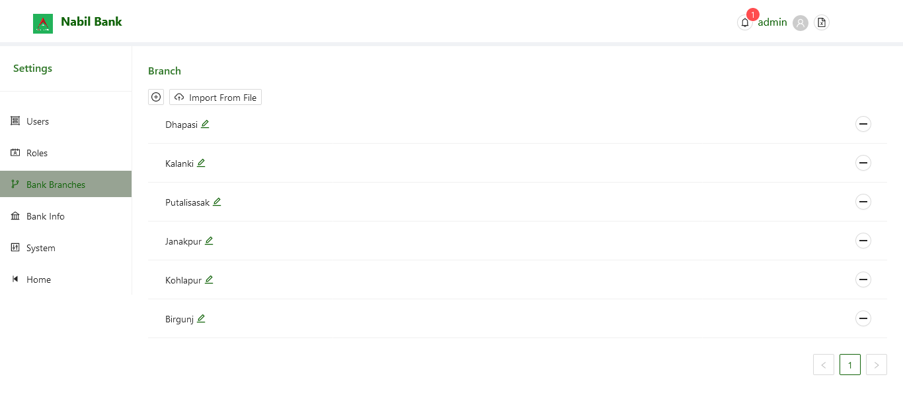
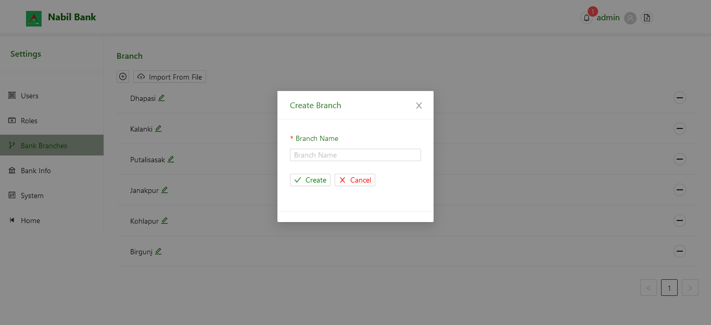

# Branch

By deafult, all pre-configured branch list will be displayed. The User can add new branches manually or import via upload file button available in the top section of the page.

### Create new Branch

To Create a new bank branch, click on the + button on the top section. Enter the name for Branch and click **Save**. Once branch is successfully saved, branch list will be updated.

Note. Branch name are mandated to be unique and cannot be repeated. On such operation, user error will be generated.
