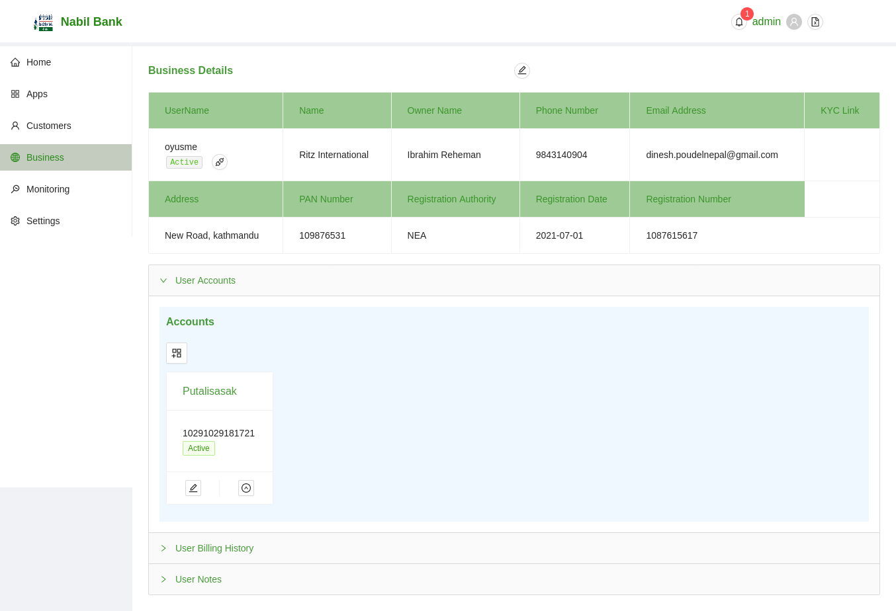
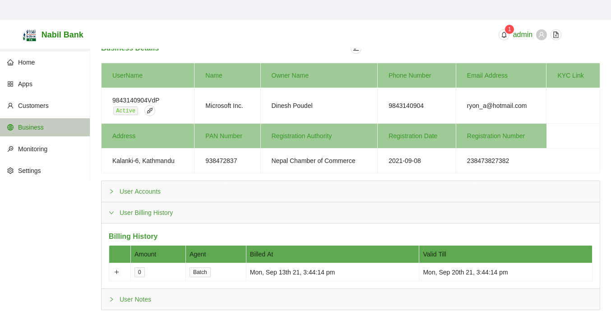
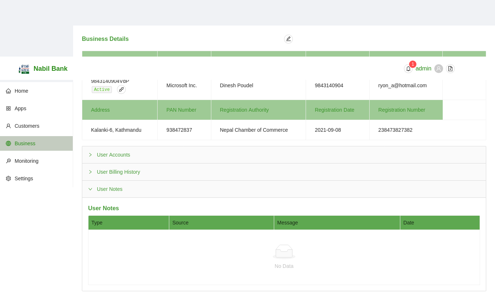
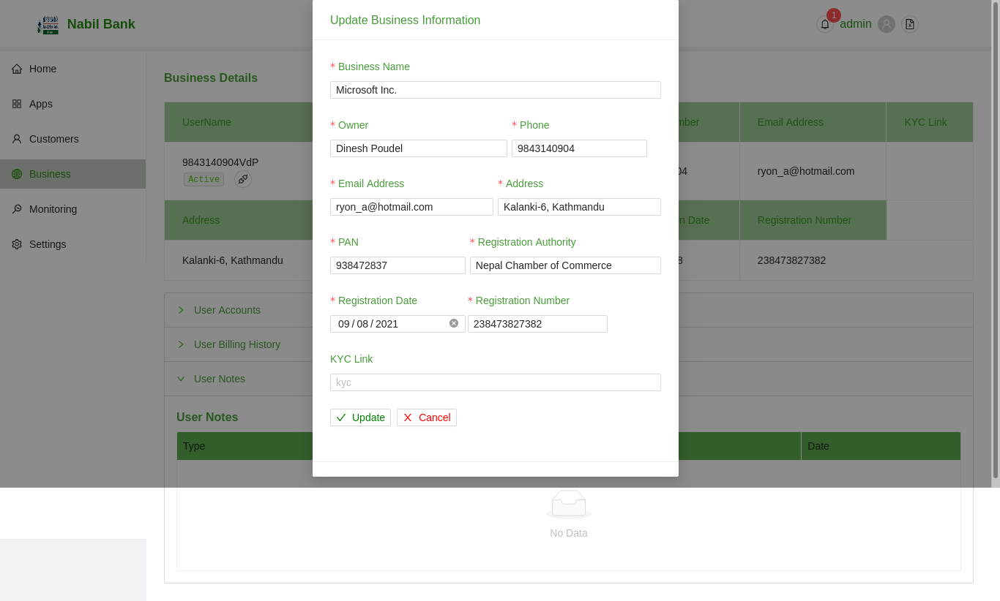
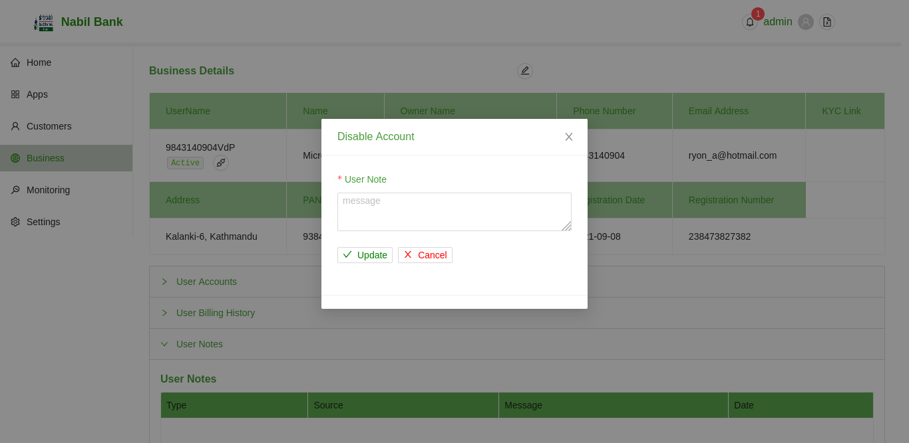

### Business User Details

To view the additional details of Business Users, click on the browse icon in the same row as the listed business users.

The details of each business user can be edited from withi the newly rendered screen. To edit business details, click on the edit button in the top section of business page.

A user can also enable/diable business account, add new bank accounts or delete existing accounts.

* View account information
    
    By dedault account information pane is visible to user. This section retains information about linked bank accounts for current business user. Admin can change status of such registration or add new bank account upon user request.

* Billing Notes Information

    By default, once the business user initiates verificaion process a user bill will be generated. This mechanism will auto bill the amount prescribed in the settings i.e. a predefined charge will be cut from linked bank account. In case of trial days is configured on system level, user bill amount will result to 0. Upon the end of trial period, user will be notified to pay the registration fees.

* User Notes Information

    The user note section contains administrative notes generated by the admin user or via the automated system.

### Edit Business Details

To edit existing information, click on the edit outlined button. A user modal will be opened to facilitate such changes.

* Edit all required fields
* Click on save button
* Updated information will be reflected

### Disable/ Enable current Business User

To enable/ disable current business user, click on the status description under username section. A pop-up will open for user consent. Type in reason for status changes and click on proceed button.

Upon successful completion, user status will change and user input notes will be displyed under user notes section.

### Reset Login Credential

To reset current business user password, click on the api outlined button under username section. A pop-up will open for user consent. Type in reason for status changes and click on proceed button.

Upon successful completion, user password will change and user input notes will be displyed under user notes section. Respective user will get email with updated credentials.

