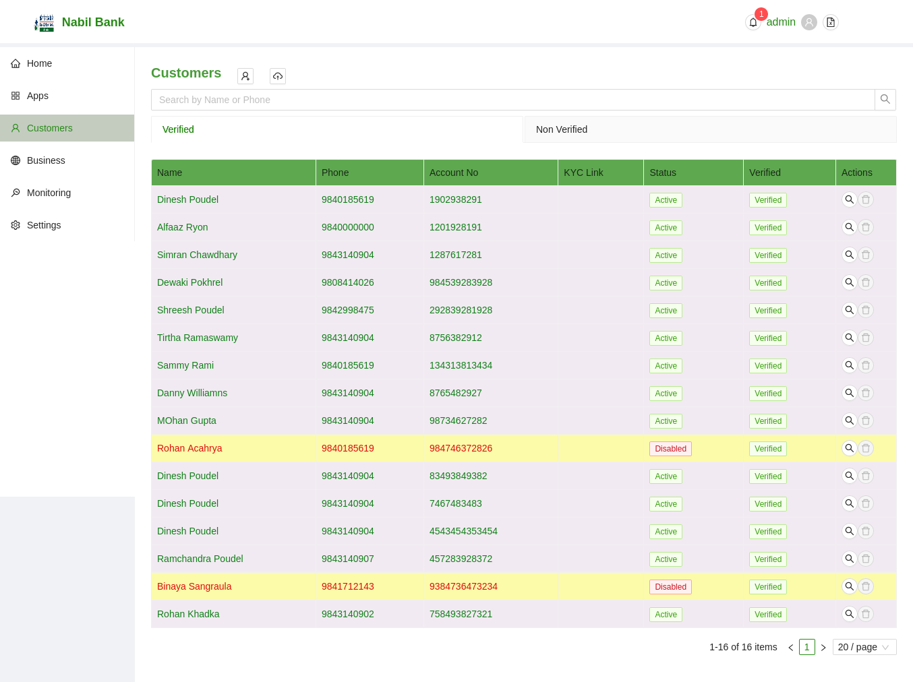

# Customers
The Customers Section enlists all the pre-registered Customers users. 
  

### Search Customers Customers
By default, Customers users will be listed wihtout any filters. User can filter such list by either Customers Name or Phone Number.

* To Search simply type the value and press enter.
* To reset the filter click on the clear icon in the search box or manually delete input text and press enter

### Verified and Unverified Users
By default, any user initiating as a customer will be listed under unverified users. Only after successful verification process, the users will be listed as verified users and will be allowed to partake in APBS related functionalitites.

### Create new Customers Users
Customers User can enroll the APBS system via any one of the following measures:

* Request the individual banks

    User will fill form requesting APBS admin for access. Admin users will create a new account, password and username will be forwared to the Customers users.

* Request with Digital Partners

    User can request for registration theough digital solutions, after verification users shall be able to utilize APBS services. In such flow, username will be auto generated from bank while password will be set by user him/herself.

## Registration via Gateway Application

Click on + Button in the top section of the page. A modal will be displayed with all required fields for such operation.

* Fill in the required details
* At least on account must be filled
* Account Number must not have been pre registered under different username.
* Click on Save
* Newly added Customers user will be displayed under unverified section.
* Once user completes self verification, user will be marked as verified and he/she can continue using APBS services. During the self verification process user will be billed with pre-defined amount.

Note: The verification mail will be forwarded to users to the registered email.

## Import Customers Users
In case, BFI wants to provide APBS to all of its users at once, Admin user can upload excel files with relevant details to create multiple accounts at a time.

Similar to the maual registration process, newly added Customers users will be listed under unverified section. Once, user confirm the verification, registered users can benifit from APBS services.