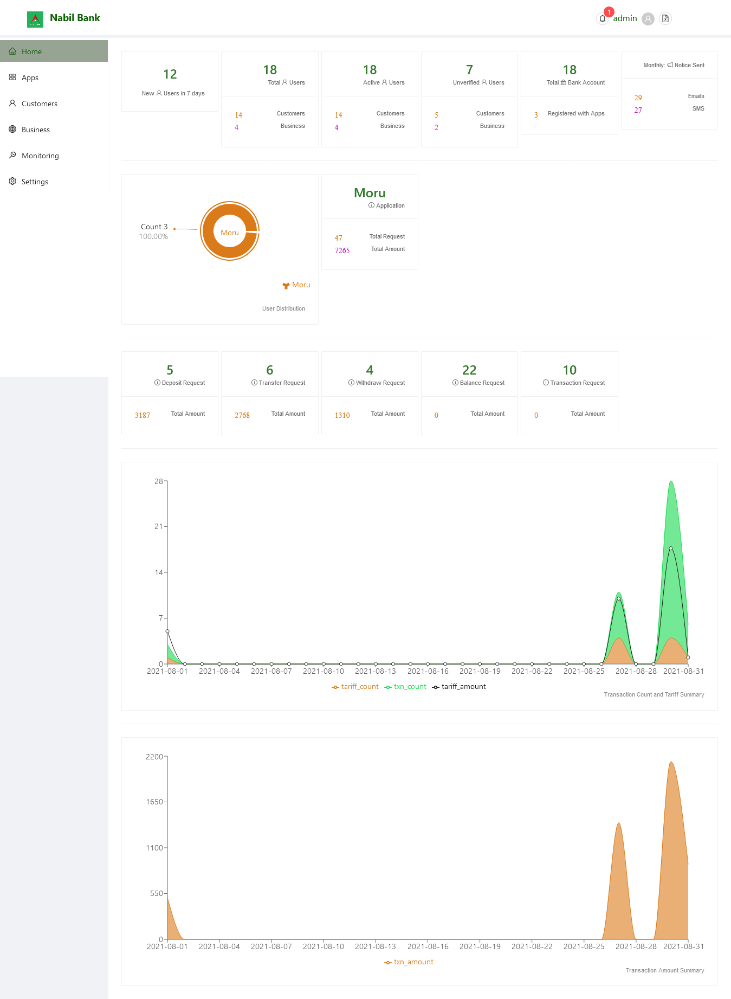

# Dashboard

Dashboard is the immediate screen user is logged into after successful verification of username and password.

It consits of Infomation Cards Stating the current status of users and Email and Sms Sent throught the system.

### User Information Cards
1. The first card on the screen shows total number of new users registered in thee gateway system.
2. Consecutive cards i.e. card 2-5 show the current status of users and number of bank accounts registred under users. Admin may get the idea of total active customers, total unverified customers and total bank accounts linked with APBS Access.
3. Last card of the first Row shows email and sms sent from the system. This information may be vital to user to check the sms flow and timely renew services if any restriction are present.

### Application Cards
4. The first card on second row of the screen show the current total user distribution against the registred applications. Consecutive cards shows brief information about total number of users per application and total transaction requests and the corresponding amount processed via the APBS system.

### Service Requests Cards
5. The third row of dashboard shows the total service requests processed by the gateway system. Total of 5 cards are available, each indicating a disinct service. Both the number of request and flow of total amount is available.

### Graphs Section
6. The remaining section of the dashboard shows the graph relating to the total tariff amount, tarriff count, and consecutive trnasaction amount and transaction count for past thirty days. These graph are intended to access the load of system in past 30 days.