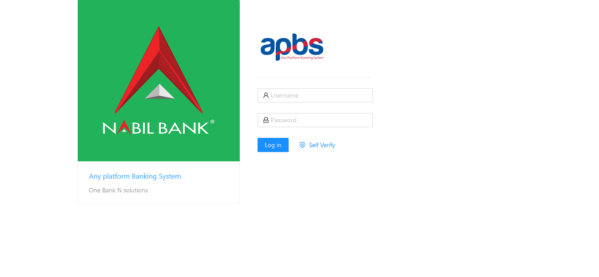
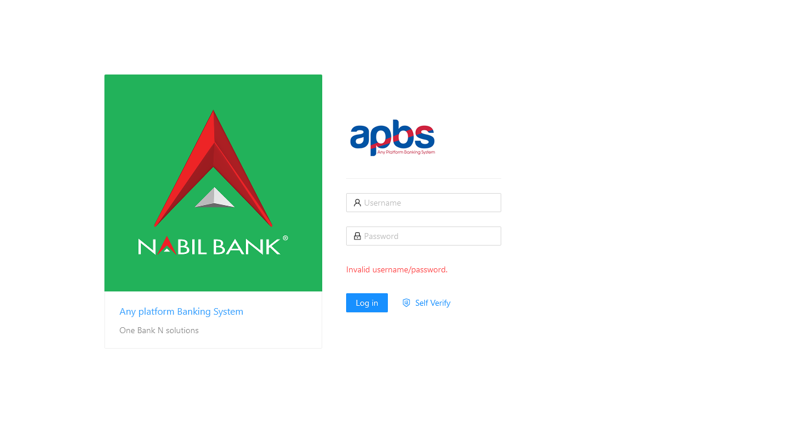

# Login

Before a user can continue administering APBS Gateway, he/she will be authenticated and authorized for proper access control. Assigning of proper access rights ensures that only the right person with right roles are enabled for selected operation.

### Steps
1. Login to the [Application Console](https://web.bank1.pnpl.com.np/)
2. Enter assigned Username and Password

3. If validation is successful, user will be redirected to dashboard section or pre-entered url.
4. If Validation Fails, error will be displayed.

### Notes
User Registration is primarily done by any user with proper administrative role. Since Gateway application is designed to orchestrate settings related to the APBS Gateway system, registration should be manual process i.e. user cannot request for new registration.
