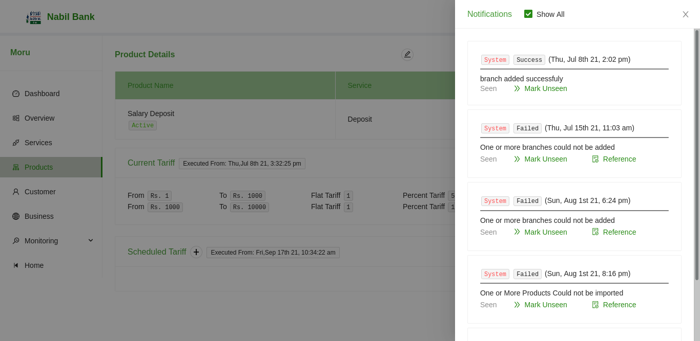

# Notifications

By default a notification badge will show the total count of new notifications in the header of each page in the application. The notification are system generated and are updated as per the user action.

The number in the bell icon of header shows total unread notification within the system.
To browse the notification, click on the bell icon.

1. By default, all notification is visible in the notification drawer.
2. User can choose to supress all seen notification i.e. view only unseen notifications by unchecking "view all" checkbox.
3. User can change status of each notification by clicking on the "mark seen" or "mark unseen" button depending upon the current status of notification.
4. If there is any file reference related to notification, it will be listed as reference. User can download such files by clicking in the reference label.

