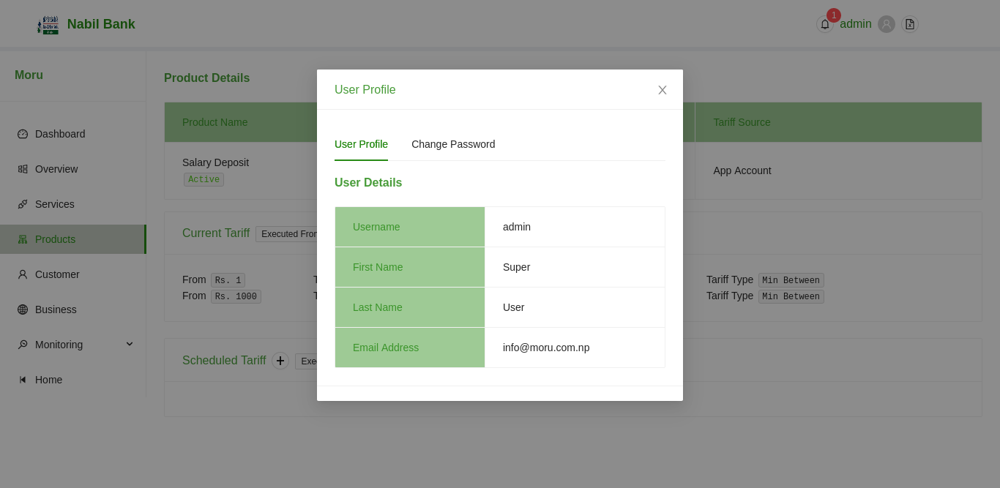
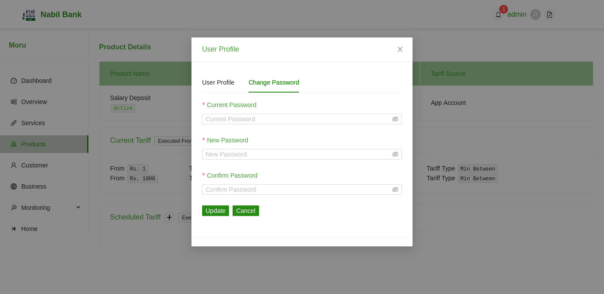

# Profile

User can see their user profile by hovering on the avatar icon and selecting User Profile Menu from dropdown list.

By default, User can see their personal details. User can also changes their current password. To change password, simply click on the "Change Password" tab.

* A form to update password should be displayed.
* Enter current password
* Enter New Password
* Confirm new Password
* Click on Update Button to save changes
* Click on Cancel button to discard changes

