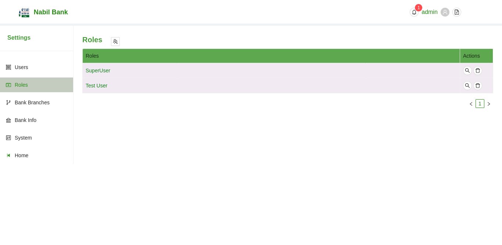
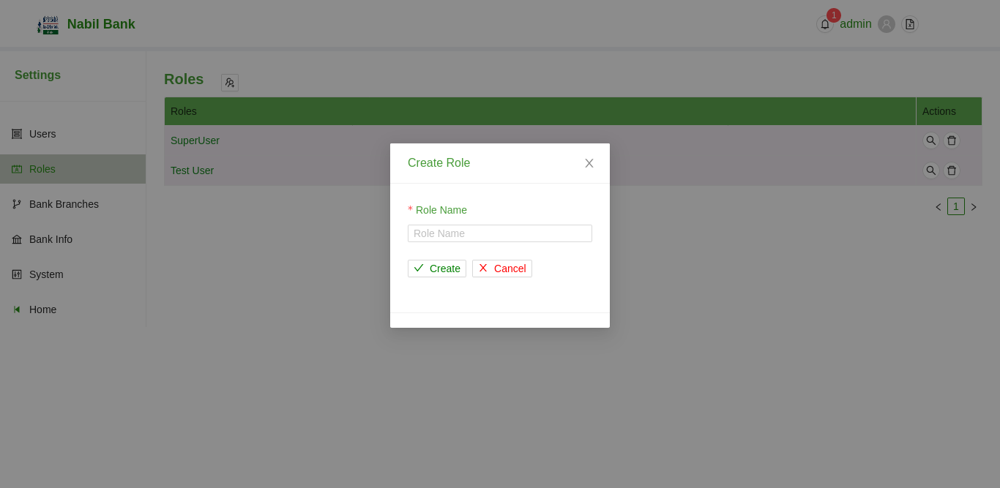
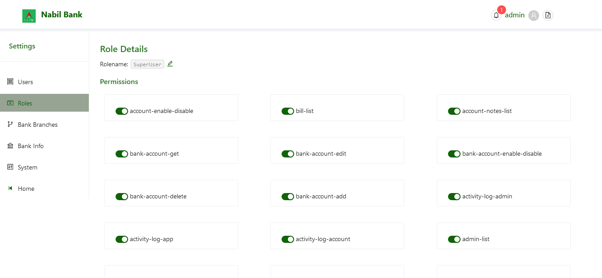

# Roles

The Role section list all available user roles by default. Like with Admin Section, new roles can be added, existing roles can be updated or deleted.

### Add Roles

To add new roles, click on the + Button on the top section. Fill in the relevant details and click on create Button.

Note: Role name is uniquely identified in the system, any attempt to repeat same role name will result in error.

### Edit / View Roles

To gather details about the permission assigned to each roles, simply click on the browse button under the action tabs.

* To edit Roles, Click on the edit button beside the role name, fill in desired value and press enter. To cancel rename operation, simply press 'Escape' button.

* To change permissions attached to roles, simply toggle the switch under permission section. Permission will be assigned or stripped and user information will be shown. 

