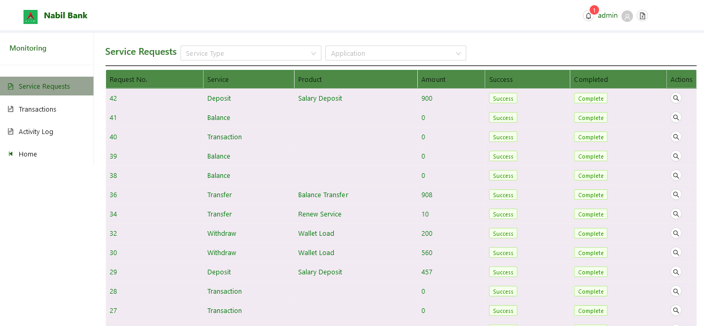
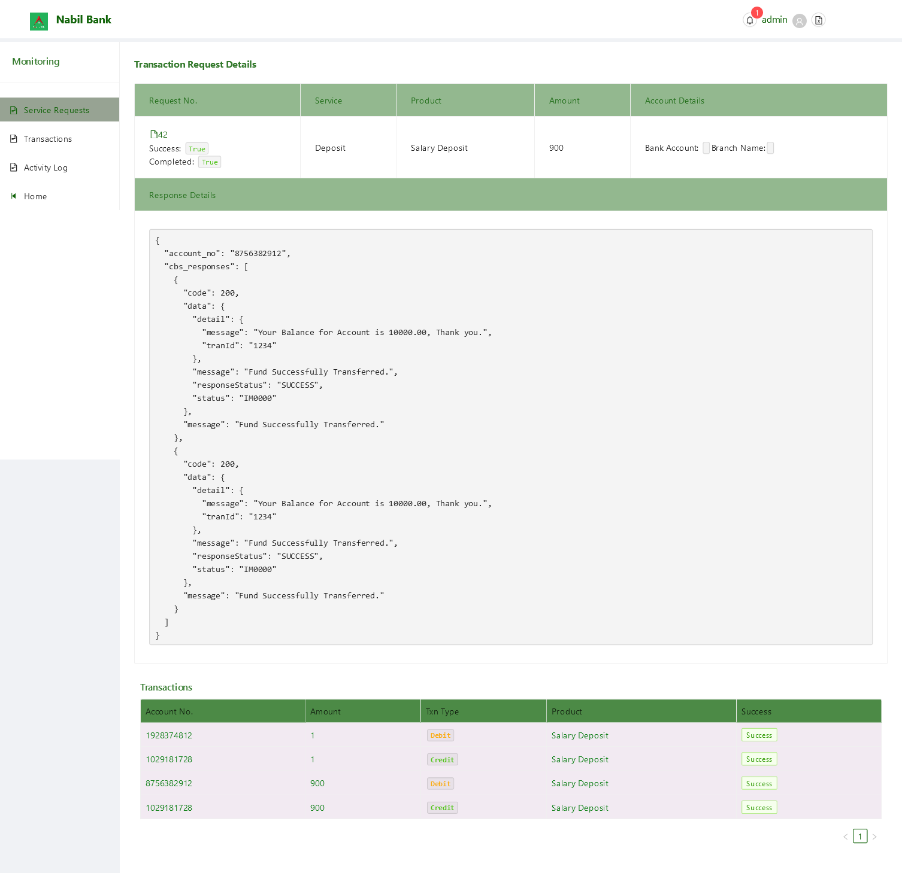
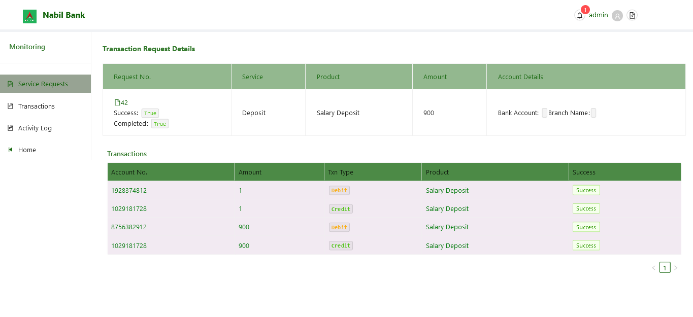

# Service Requests

By deafult, all service requests from customers front are listed. The **status** and **completion** of such requests can be verified from the Success and Completed Column.

Note: **Success** referes that transaction was sucessfully executed. For a transaction to be **Complete**, it have successfull run. One key difference between these fields is, a successful request will always be completed however, a completed requets may not have always been successful, i.e. transaction could have been rejected from core banking system itself.

Note: A user can also filter current listed transaction with respect to requesting service type or application name.

Note: User may browse all transactions py simply chaning current active page in the pagination footer of table.

# Service Request Details

To browse the service request Details simply click on the browse icon in the row of desired service request. The following information is available within the service details page.

### CBS Response

User can view the actual response forwared via the CBS. To view such details, click on the **file icon** under the Request No. Upon successful click, user can see the response details. To hide the response details, user can again click on the same **file** button.

### Transaction Details

User can see transaction details related to each service details. In general, only wihdraw, deposit and transfer service will have transaction listed.

At first glance, list of transaction may be confusing, however note that for each transaction:
* Amount is withdrawn from source account
* Tariff Charge is Withdrawn
* Amount is deposited on destination account
* Tariff Charge is deposited in APBS Tariff Account

Hence, for a single request, up top or more than 4 transactions can be listed.
