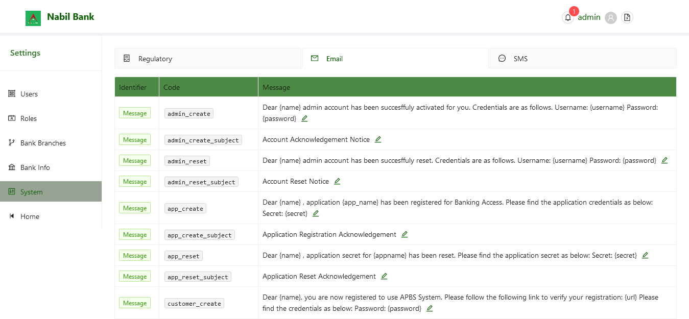
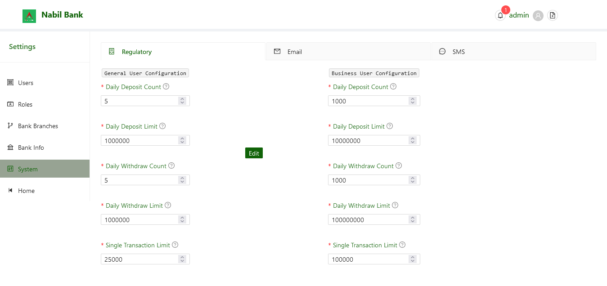

# Email and SMS Notes Information

**Email** and **SMS** tabs respectively displays currently set user email and sms notes. User may edit such notes or simply browse all available notes and email.

### Steps to Edit Information

By default, message in sms and email section will be readonly. To update existing message:

* Click on Edit Button
* User can now see a update modal
* Edit message value
* Click Save
* User updated values will be reflected

Note: User can only update message section and shouldn't be confused with permission issues or as a bug.

Note: The variables in the curly braces , examples {name} should not be edited. Upon edit of such variables, future email and notification through the system may fail.

# Regulatory Policies

The Regulatory Policies tabs consists of mandated transaction limits as prescribed by the user. These settings must confirm to NRB policies. Admin users are solely responsible to update such information.

To update existing information:
* Click on the edit button
* User shall now see Save and Cancel button
* Edit respective forms
* Click save to save changes or Cancel to discard changes.