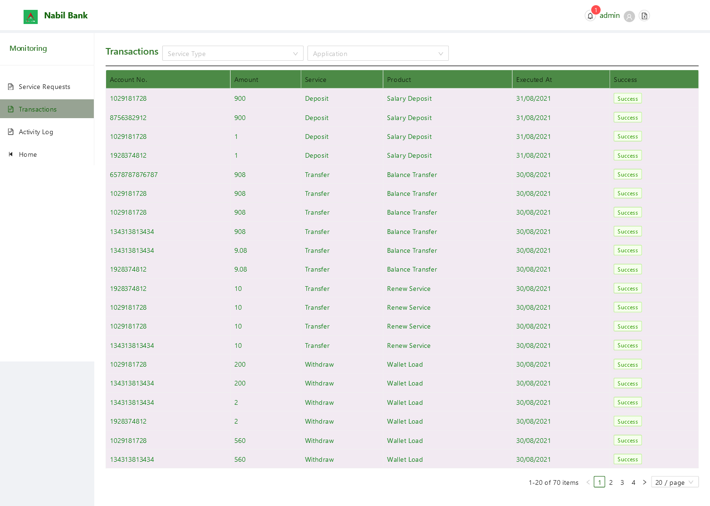

# Transactions

By deafult, all available transactions are listed. The status and completion of such transaction can be verified from the Status and Completed Column.

Note: A user can also filter current listed transaction with respect to requesting service type or application name.

Note: User may browse all transactions py simply chaning current active page in the pagination footer of table.